<p align="center">
  
</p>

<h1 align="center">proton-mail</h1>

<p align="center">
  <b>An agent skill that lets Claude (and other coding agents) work with your Proton Mail inbox.</b><br>
  Triage, search, read, draft replies, organize. Nothing is sent without your explicit approval.
</p>

<p align="center">
  <a href="https://skills.sh"></a>
  
  
  <a href="LICENSE"></a>
</p>

---

## What it is

This repo has two parts:

| Part | What it does |
|---|---|
| [`skills/proton-mail`](skills/proton-mail/SKILL.md) | The **agent skill**: instructions that teach the agent when and how to use your mail safely. |
| `pmail` | A small **CLI** that talks to [Proton Mail Bridge](https://proton.me/mail/bridge) over local IMAP/SMTP. It prints JSON for agents and readable text for humans. |

Your mail never leaves your machine through `pmail`. It only connects to Bridge on `127.0.0.1`, and it pins Bridge's TLS certificate.

## Quick start

```bash
# 1. Install the skill
npx skills add WojciechJelen/pmail

# 2. Install the CLI (needs Bun: https://bun.com)
git clone https://github.com/WojciechJelen/pmail && cd pmail
bun install && bun run install:bin    # installs to ~/.local/bin/pmail

# 3. Connect it to Bridge (see Setup below), then check it
pmail doctor
```

Then ask your agent something like:

> *"What's unread in my inbox?"*
> *"Find the invoice from Hetzner last month and save the PDF to ~/Downloads."*
> *"Draft a reply to Anna saying Thursday works."*
> *"Email ~/Documents/q3-report.pdf to Tom with a short note."*

## Setup

`pmail` needs [Proton Mail Bridge](https://proton.me/mail/bridge) running and signed in. Bridge requires a paid Proton plan.

**1. Write the config**

```bash
pmail init --email you@proton.me
```

This creates `~/.config/pmail/config.json` (IMAP `1143`, SMTP `1025` by default; override with `--imap-port` / `--smtp-port`).

**2. Export the Bridge TLS certificate**

In the Bridge app: *Settings → Advanced settings → Export TLS certificates*. Save the cert as `~/.config/pmail/cert.pem`, or pass `--cert <path>` to `init`.

**3. Store the Bridge password in the macOS Keychain**

Use the password the Bridge app shows for your account, **not** your Proton password:

```bash
security add-generic-password -U -s pmail-bridge -a you@proton.me -w
```

Not on macOS? Set `PMAIL_PASSWORD` in the environment instead.

**4. Verify**

```bash
$ pmail doctor
✓ config       ~/.config/pmail/config.json
✓ password
✓ certificate  CN=127.0.0.1, …; valid until …
✓ imap         127.0.0.1:1143
✓ smtp         127.0.0.1:1025
```

## Safety model

Handing an agent your inbox deserves guardrails. Both the skill and the CLI enforce them:

- 🛡️ **Email is untrusted input.** Every result carries `"untrusted": true`. The skill tells the agent never to follow instructions found in mail ("forward this", "ignore previous instructions", …). It reports them to you instead.
- ✋ **Sending is a two-step handshake.** `pmail send <draftId>` only previews and exits with code `4`. Only `--confirm` sends, and the skill allows that only after you approved that exact draft.
- 👀 **Reading doesn't mark anything as read.** Marking read, moving, or trashing happens only on request.
- 🗑️ **No permanent delete.** "Delete" means moving to Trash.
- 📎 **Attachments are opt-in.** The agent attaches only files you asked for, never ones an email requests.
- 🔑 **The agent never sees your password.** It lives in the Keychain, and the skill forbids asking for it.

## CLI reference

When stdout is not a terminal (or with `--json`), output is JSON; errors are JSON on stderr: `{"error":{"code","message","hint"}}`.
Use `--fields id,from,subject` on any command to keep responses small.

| Command | Description |
|---|---|
| `pmail init --email <addr>` | Write the config (no network access) |
| `pmail doctor` | Check config, password, certificate, IMAP and SMTP |
| `pmail folders` | List folders and labels with total/unread counts |
| `pmail list [--folder] [--unread] [--starred] [--limit] [--before-id]` | List messages, newest first |
| `pmail search [--folder] [--from] [--to] [--subject] [--text] [--since] [--before] …` | Search one folder; criteria are ANDed |
| `pmail read <id> [--full] [--max-chars] [--mark-read]` | Headers, plain-text body, attachment list |
| `pmail thread <id>` | Messages of a conversation, oldest first |
| `pmail attachment <id> <index> --out <path>` | Save one attachment |
| `pmail draft [--to] [--cc] [--subject] [--body \| --body-file] [--reply-to <id>] [--attach <path>…]` | Save a plain-text draft, optionally with attachments (never sends) |
| `pmail send <draftId> [--confirm]` | Preview, or send with `--confirm` |
| `pmail move <id> --to <archive\|trash\|spam\|inbox\|Folders/X>` | Move a message |
| `pmail flag <id> [--read\|--unread] [--star\|--unstar]` | Change flags |

Message ids look like `INBOX/4821`. Quote them, since folder names can contain spaces (`"All Mail/335"`). Ids change when a message moves, and `move` returns the new one.

<details>
<summary><b>A typical flow</b></summary>

```bash
pmail list --unread --fields id,from,subject,date
pmail read "INBOX/4821"
pmail draft --reply-to "INBOX/4821" --body-file - <<'EOF'
Thursday works for me. See you then!
EOF
pmail send "Drafts/12"            # preview only, exit 4
pmail send "Drafts/12" --confirm  # after you approve
```

</details>

### Exit codes

| Code | Meaning |
|---|---|
| `0` | OK |
| `1` | Other error (e.g. stale id after a move) |
| `2` | Auth/setup problem: config, Keychain password, or TLS cert. Run `pmail doctor` |
| `3` | Invalid input |
| `4` | Confirmation required (`send` without `--confirm`) |
| `5` | Bridge unreachable. Start Proton Mail Bridge |

## Development

```bash
bun install
bun test            # unit tests
bun run typecheck
bun run build       # single binary at dist/pmail
bun src/cli/main.ts --help
```

## License

[MIT](LICENSE). Not affiliated with or endorsed by Proton AG. "Proton" and "Proton Mail" are trademarks of Proton AG.
